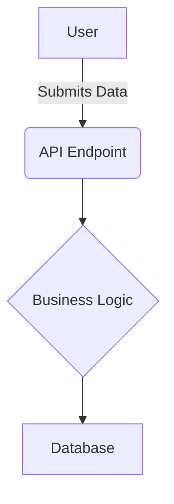

# dw6_test_bed_v5 - Cycle 6 - Technical Specification

**Date:** 2025-06-25

## 1. Overview

*A brief summary of the goals for this cycle. What business value will be delivered?*

## 2. Scope

### In Scope

*   Clearly define what functionalities will be built.

### Out of Scope

*   Clearly define what will *not* be built to manage expectations.

## 3. System Architecture

*A high-level description of the proposed architecture. How do the components interact?*

## 4. Data Model

*Description of new or modified data structures, database schemas, and relationships.*

## 5. Functional Requirements (User Stories)

*   **US-01:** As a [user type], I want to [action] so that [benefit].
    *   **Acceptance Criteria 1:** [Condition to be met for the story to be considered complete]
    *   **Acceptance Criteria 2:** [Another condition]

## 6. Implementation Plan

*A numbered, logical list of tasks for the Coder. This is the direct input for the next stage.*

1.  **Task:**
2.  **Task:**
3.  **Task:**

## 7. Questions & Assumptions

*   **Question:** [Any open questions for stakeholders?]
*   **Assumption:** [Any assumptions made that could impact the project?]

